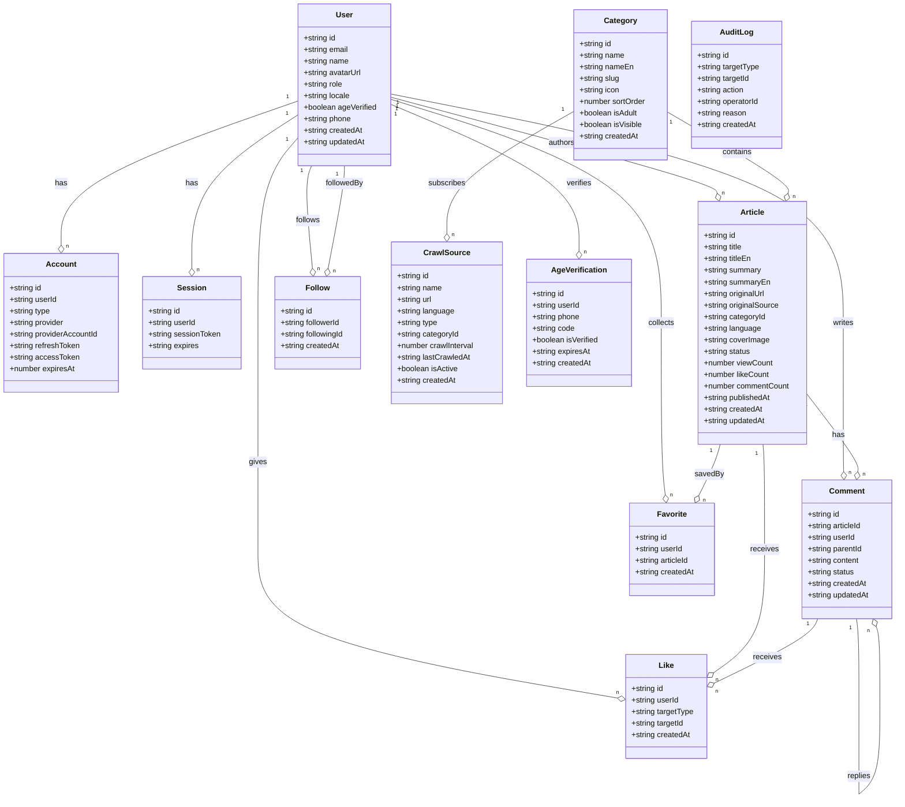
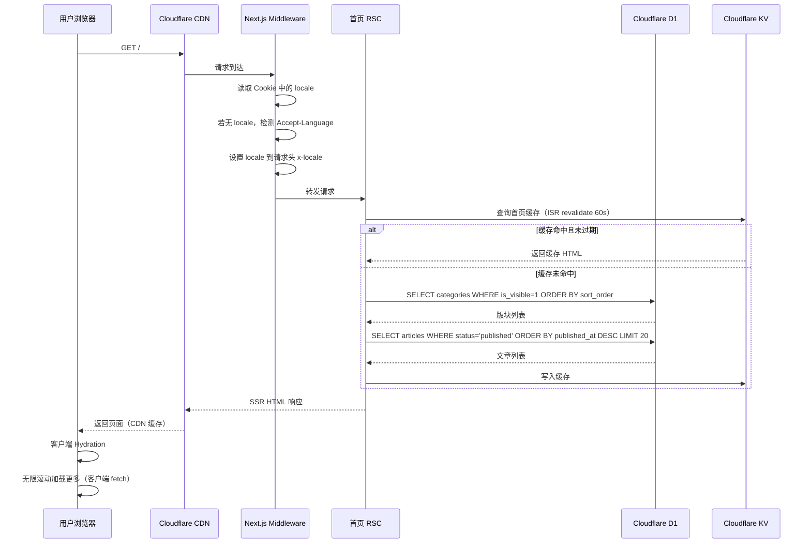
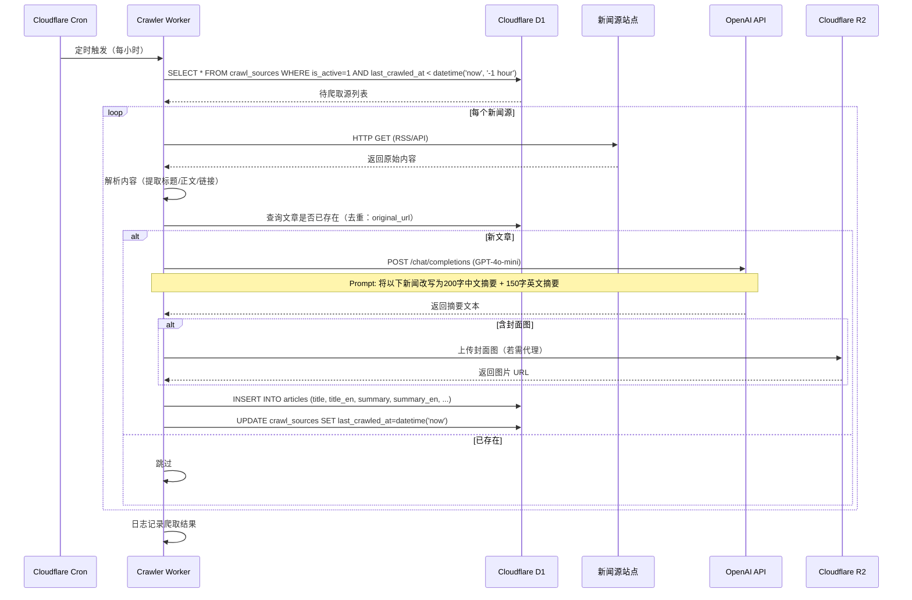
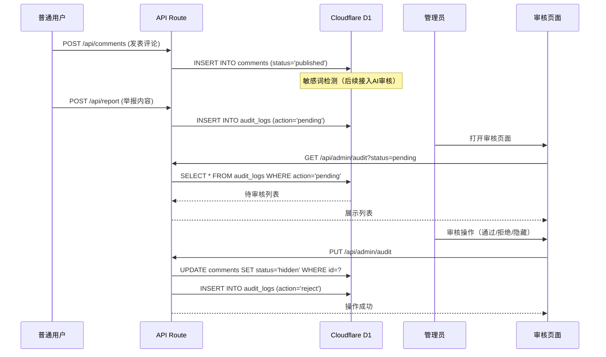
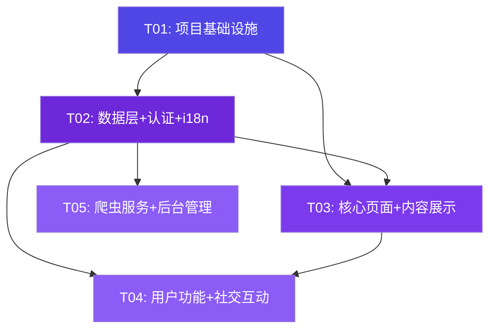

# DreamPulse 系统架构设计文档

> **版本**: v1.0
> **日期**: 2026-05-30
> **架构师**: 高见远 (Gao)
> **状态**: Draft

---

## 一、实现方案与框架选型

### 1.1 核心技术挑战

| 挑战 | 描述 | 解决思路 |
|---|---|---|
| Cloudflare 生态集成 | Next.js SSR 在 Cloudflare Pages 上运行需特殊适配 | 使用 `@cloudflare/next-on-pages` 适配器，Edge Runtime 兼容 |
| AI 摘要改写 | 爬取内容需实时改写为精炼摘要，涉及延迟和成本 | 异步队列处理，GPT-4o-mini 低成本改写，失败重试机制 |
| 多语言内容同步 | 中英双语内容需分源爬取、独立存储、按用户偏好展示 | 文章双语言字段存储，爬虫按语言配置源，前端 Cookie 存偏好 |
| 成人版块合规 | 年龄认证需可靠验证，内容需与普通版块隔离 | 手机号短信验证码认证，中间件拦截未认证请求 |
| SSR 性能 | 全球用户访问需低延迟首屏 | Cloudflare Edge CDN + ISR 混合渲染策略 |

### 1.2 技术栈确认

| 层次 | 技术选型 | 选型理由 |
|---|---|---|
| **前端框架** | Next.js 15 (App Router) | SSR/ISR 原生支持，React Server Components，API Routes 全栈能力 |
| **样式方案** | Tailwind CSS 4 + CSS Variables | 原子化 CSS，深色主题变量切换，零运行时开销 |
| **UI 组件** | Radix UI + 自研组件 | 无样式原子组件，完全可控深色定制，无默认样式冲突 |
| **数据库** | Cloudflare D1 (SQLite) | 零冷启动、Edge 就近读取、免费额度充足（5M 读/天）、与 Pages 同生态 |
| **文件存储** | Cloudflare R2 | S3 兼容、10GB 免费存储、无出口流量费、与 Worker 直连 |
| **认证** | Auth.js v5 (NextAuth) | 原生 App Router 支持、D1 适配器、内置 Google/GitHub OAuth |
| **AI 改写** | OpenAI API (GPT-4o-mini) | 成本低（$0.15/1M input tokens）、质量稳定、异步调用 |
| **爬虫服务** | Cloudflare Workers + Cron Triggers | 免费 5 个定时任务、与 D1/R2 直连、全球边缘执行 |
| **短信服务** | Twilio Verify API | 全球手机号覆盖、验证码服务成熟、年龄验证合规 |
| **部署** | Cloudflare Pages | 全球 CDN、自动部署、Edge Functions 支持 |
| **i18n** | next-intl | App Router 原生集成、Cookie 策略、服务端翻译 |
| **表单验证** | Zod | 类型安全的 schema 验证、API 路由入参校验 |
| **图标** | Lucide React | 轻量、树摇优化、科技风格匹配 |

### 1.3 架构模式

采用 **分层架构 + Edge-First** 模式：

```
┌─────────────────────────────────────────────────────┐
│                   Cloudflare CDN                     │
├─────────────┬───────────────────┬───────────────────┤
│  Next.js    │   API Routes      │  Cron Workers     │
│  SSR/ISR    │   (Edge Runtime)  │  (Crawler)        │
├─────────────┼───────────────────┼───────────────────┤
│   RSC       │   Auth.js         │   OpenAI API      │
│  Pages      │   Zod Validation  │   RSS Parser      │
├─────────────┴───────────────────┴───────────────────┤
│              Cloudflare D1 (SQLite)                  │
│              Cloudflare R2 (Object Storage)          │
│              Cloudflare KV (Session/Cache)           │
└─────────────────────────────────────────────────────┘
```

- **展示层**：React Server Components 负责 SSR，客户端组件负责交互
- **API 层**：Next.js Route Handlers (Edge Runtime)，Zod 入参校验
- **数据层**：D1 主存储，R2 文件存储，KV 缓存/会话
- **异步层**：Workers Cron 触发爬虫，OpenAI API 异步改写

---

## 二、文件列表

```
dreampulse/
├── .github/
│   └── workflows/
│       └── deploy.yml                     # CI/CD 部署流水线
├── docs/
│   ├── PRD.md
│   ├── ARCHITECTURE.md
│   ├── class-diagram.mermaid
│   └── sequence-diagram.mermaid
├── public/
│   ├── favicon.ico
│   ├── robots.txt                         # 搜索引擎爬虫规则
│   ├── sitemap.xml                        # 静态 sitemap（动态覆盖）
│   └── images/
│       └── logo.svg                       # DreamPulse Logo
├── src/
│   ├── app/
│   │   ├── layout.tsx                     # 根布局（主题、字体、Provider）
│   │   ├── page.tsx                       # 首页
│   │   ├── globals.css                    # 全局样式 + Tailwind + CSS 变量
│   │   ├── not-found.tsx                  # 404 页面
│   │   ├── sitemap.ts                     # 动态 sitemap 生成
│   │   ├── robots.ts                      # 动态 robots.txt 生成
│   │   ├── section/
│   │   │   └── [slug]/
│   │   │       └── page.tsx               # 版块页
│   │   ├── article/
│   │   │   └── [id]/
│   │   │       └── page.tsx               # 文章详情页
│   │   ├── auth/
│   │   │   ├── login/
│   │   │   │   └── page.tsx               # 登录页
│   │   │   └── register/
│   │   │       └── page.tsx               # 注册页
│   │   ├── profile/
│   │   │   └── page.tsx                   # 个人中心
│   │   ├── age-verify/
│   │   │   └── page.tsx                   # 年龄认证页
│   │   ├── admin/
│   │   │   ├── layout.tsx                 # 后台布局
│   │   │   ├── page.tsx                   # 数据看板
│   │   │   ├── audit/
│   │   │   │   └── page.tsx               # 内容审核
│   │   │   ├── users/
│   │   │   │   └── page.tsx               # 用户管理
│   │   │   └── categories/
│   │   │       └── page.tsx               # 版块管理
│   │   └── api/
│   │       ├── auth/
│   │       │   └── [...nextauth]/
│   │       │       └── route.ts           # Auth.js 路由
│   │       ├── articles/
│   │       │   ├── route.ts               # GET 列表 / POST 创建
│   │       │   └── [id]/
│   │       │       └── route.ts           # GET 详情 / PUT 更新 / DELETE
│   │       ├── categories/
│   │       │   └── route.ts               # GET 版块列表
│   │       ├── comments/
│   │       │   ├── route.ts               # GET / POST 评论
│   │       │   └── [id]/
│   │       │       └── route.ts           # PUT / DELETE 评论
│   │       ├── likes/
│   │       │   └── route.ts               # POST 点赞 / DELETE 取消
│   │       ├── favorites/
│   │       │   └── route.ts               # GET 列表 / POST 收藏 / DELETE 取消
│   │       ├── follows/
│   │       │   └── route.ts               # POST 关注 / DELETE 取关
│   │       ├── user/
│   │       │   └── profile/
│   │       │       └── route.ts           # GET / PUT 个人资料
│   │       ├── age-verify/
│   │       │   └── route.ts               # POST 发送验证码 / PUT 验证
│   │       └── admin/
│   │           ├── audit/
│   │           │   └── route.ts           # GET 待审列表 / PUT 审核操作
│   │           ├── users/
│   │           │   └── route.ts           # GET 用户列表 / PUT 封禁解封
│   │           ├── categories/
│   │           │   └── route.ts           # CRUD 版块
│   │           └── stats/
│   │               └── route.ts           # GET 看板数据
│   ├── components/
│   │   ├── layout/
│   │   │   ├── Header.tsx                 # 顶部导航栏
│   │   │   ├── Footer.tsx                 # 底部信息栏
│   │   │   ├── Sidebar.tsx                # 侧边栏导航
│   │   │   └── MobileNav.tsx              # 移动端导航
│   │   ├── article/
│   │   │   ├── ArticleCard.tsx            # 文章卡片
│   │   │   ├── ArticleList.tsx            # 文章列表（无限滚动）
│   │   │   ├── ArticleDetail.tsx          # 文章详情组件
│   │   │   └── ArticleSkeleton.tsx        # 文章骨架屏
│   │   ├── comment/
│   │   │   ├── CommentList.tsx            # 评论列表
│   │   │   ├── CommentItem.tsx            # 单条评论（含楼中楼）
│   │   │   └── CommentForm.tsx            # 评论输入框
│   │   ├── user/
│   │   │   ├── LoginForm.tsx              # 登录表单
│   │   │   ├── RegisterForm.tsx           # 注册表单
│   │   │   └── UserProfile.tsx            # 用户资料卡
│   │   ├── admin/
│   │   │   ├── AuditTable.tsx             # 审核表格
│   │   │   ├── UserTable.tsx              # 用户管理表格
│   │   │   ├── CategoryManager.tsx        # 版块管理组件
│   │   │   └── StatsPanel.tsx             # 数据看板面板
│   │   ├── ui/
│   │   │   ├── Button.tsx                 # 按钮
│   │   │   ├── Card.tsx                   # 卡片容器
│   │   │   ├── Input.tsx                  # 输入框
│   │   │   ├── Modal.tsx                  # 弹窗
│   │   │   ├── Badge.tsx                  # 标签
│   │   │   ├── Tabs.tsx                   # 选项卡
│   │   │   ├── Avatar.tsx                 # 头像
│   │   │   ├── Pagination.tsx             # 分页
│   │   │   ├── Skeleton.tsx               # 骨架屏
│   │   │   ├── Toast.tsx                  # 提示消息
│   │   │   └── Dropdown.tsx               # 下拉菜单
│   │   └── shared/
│   │       ├── LanguageSwitcher.tsx        # 语言切换器
│   │       ├── ShareButtons.tsx            # 社交分享按钮组
│   │       ├── AgeVerifyGuard.tsx          # 年龄认证守卫
│   │       └── InfiniteScroll.tsx          # 无限滚动容器
│   ├── lib/
│   │   ├── db/
│   │   │   ├── schema.ts                  # D1 表结构类型定义
│   │   │   ├── client.ts                  # D1 客户端工具函数
│   │   │   └── migrations/
│   │   │       └── 0001_init.sql          # 初始化建表 SQL
│   │   ├── auth/
│   │   │   ├── config.ts                  # Auth.js 配置
│   │   │   └── middleware.ts              # 认证中间件工具
│   │   ├── ai/
│   │   │   └── summarize.ts               # AI 摘要生成
│   │   ├── i18n/
│   │   │   ├── config.ts                  # i18n 配置
│   │   │   ├── dictionaries/
│   │   │   │   ├── en.json                # 英文字典
│   │   │   │   └── zh.json                # 中文字典
│   │   │   └── get-dictionary.ts          # 字典加载器
│   │   ├── r2/
│   │   │   └── client.ts                  # R2 存储工具函数
│   │   └── utils/
│   │       ├── api.ts                     # API 响应格式化工具
│   │       └── validators.ts              # Zod 验证 Schema
│   ├── hooks/
│   │   ├── useAuth.ts                     # 认证状态 Hook
│   │   ├── useArticles.ts                 # 文章数据 Hook
│   │   ├── useComments.ts                 # 评论数据 Hook
│   │   ├── useLocale.ts                   # 语言偏好 Hook
│   │   └── useInfiniteScroll.ts           # 无限滚动 Hook
│   ├── types/
│   │   ├── index.ts                       # 共享类型汇总导出
│   │   ├── article.ts                     # 文章相关类型
│   │   ├── user.ts                        # 用户相关类型
│   │   └── api.ts                         # API 响应类型
│   └── middleware.ts                       # Next.js 中间件（语言检测、认证拦截）
├── workers/
│   ├── crawler/
│   │   ├── index.ts                       # 爬虫 Worker 入口
│   │   ├── sources.ts                     # 新闻源配置
│   │   ├── parser.ts                      # RSS/HTML 解析器
│   │   └── wrangler.toml                  # 爬虫 Worker 配置
│   └── age-verify/
│       ├── index.ts                       # 年龄验证 Worker（短信发送）
│       └── wrangler.toml                  # 验证 Worker 配置
├── package.json
├── next.config.ts
├── tailwind.config.ts
├── tsconfig.json
├── postcss.config.mjs
├── wrangler.toml                          # 主站 Cloudflare 配置
├── open-next.config.ts                    # @cloudflare/next-on-pages 配置
└── .env.example                           # 环境变量模板
```

---

## 三、数据结构与接口

### 3.1 核心数据模型（类图）

详见 `docs/class-diagram.mermaid`



### 3.2 D1 数据库 Schema（SQL）

```sql
-- ==============================
-- DreamPulse D1 初始化建表脚本
-- ==============================

-- 用户表
CREATE TABLE users (
  id TEXT PRIMARY KEY DEFAULT (lower(hex(randomblob(16)))),
  email TEXT UNIQUE NOT NULL,
  name TEXT NOT NULL,
  avatar_url TEXT,
  role TEXT DEFAULT 'user' CHECK(role IN ('user', 'moderator', 'admin')),
  locale TEXT DEFAULT 'en',
  age_verified INTEGER DEFAULT 0,
  phone TEXT,
  created_at TEXT DEFAULT (datetime('now')),
  updated_at TEXT DEFAULT (datetime('now'))
);

-- OAuth 账户表（Auth.js）
CREATE TABLE accounts (
  id TEXT PRIMARY KEY DEFAULT (lower(hex(randomblob(16)))),
  user_id TEXT NOT NULL REFERENCES users(id) ON DELETE CASCADE,
  type TEXT NOT NULL,
  provider TEXT NOT NULL,
  provider_account_id TEXT NOT NULL,
  refresh_token TEXT,
  access_token TEXT,
  expires_at INTEGER,
  token_type TEXT,
  scope TEXT,
  id_token TEXT,
  session_state TEXT,
  UNIQUE(provider, provider_account_id)
);

-- 会话表（Auth.js）
CREATE TABLE sessions (
  id TEXT PRIMARY KEY DEFAULT (lower(hex(randomblob(16)))),
  user_id TEXT NOT NULL REFERENCES users(id) ON DELETE CASCADE,
  session_token TEXT UNIQUE NOT NULL,
  expires TEXT NOT NULL
);

-- 验证令牌表（Auth.js）
CREATE TABLE verification_tokens (
  identifier TEXT NOT NULL,
  token TEXT UNIQUE NOT NULL,
  expires TEXT NOT NULL
);

-- 版块表
CREATE TABLE categories (
  id TEXT PRIMARY KEY DEFAULT (lower(hex(randomblob(16)))),
  name TEXT NOT NULL,
  name_en TEXT NOT NULL,
  slug TEXT UNIQUE NOT NULL,
  icon TEXT,
  sort_order INTEGER DEFAULT 0,
  is_adult INTEGER DEFAULT 0,
  is_visible INTEGER DEFAULT 1,
  created_at TEXT DEFAULT (datetime('now'))
);

-- 文章表
CREATE TABLE articles (
  id TEXT PRIMARY KEY DEFAULT (lower(hex(randomblob(16)))),
  title TEXT NOT NULL,
  title_en TEXT,
  summary TEXT NOT NULL,
  summary_en TEXT,
  original_url TEXT NOT NULL,
  original_source TEXT NOT NULL,
  category_id TEXT NOT NULL REFERENCES categories(id),
  language TEXT DEFAULT 'zh',
  cover_image TEXT,
  status TEXT DEFAULT 'published' CHECK(status IN ('draft', 'published', 'archived', 'rejected')),
  view_count INTEGER DEFAULT 0,
  like_count INTEGER DEFAULT 0,
  comment_count INTEGER DEFAULT 0,
  published_at TEXT,
  created_at TEXT DEFAULT (datetime('now')),
  updated_at TEXT DEFAULT (datetime('now'))
);

-- 评论表
CREATE TABLE comments (
  id TEXT PRIMARY KEY DEFAULT (lower(hex(randomblob(16)))),
  article_id TEXT NOT NULL REFERENCES articles(id) ON DELETE CASCADE,
  user_id TEXT NOT NULL REFERENCES users(id),
  parent_id TEXT REFERENCES comments(id) ON DELETE CASCADE,
  content TEXT NOT NULL,
  status TEXT DEFAULT 'published' CHECK(status IN ('published', 'hidden', 'deleted')),
  created_at TEXT DEFAULT (datetime('now')),
  updated_at TEXT DEFAULT (datetime('now'))
);

-- 点赞表
CREATE TABLE likes (
  id TEXT PRIMARY KEY DEFAULT (lower(hex(randomblob(16)))),
  user_id TEXT NOT NULL REFERENCES users(id),
  target_type TEXT NOT NULL CHECK(target_type IN ('article', 'comment')),
  target_id TEXT NOT NULL,
  created_at TEXT DEFAULT (datetime('now')),
  UNIQUE(user_id, target_type, target_id)
);

-- 收藏表
CREATE TABLE favorites (
  id TEXT PRIMARY KEY DEFAULT (lower(hex(randomblob(16)))),
  user_id TEXT NOT NULL REFERENCES users(id),
  article_id TEXT NOT NULL REFERENCES articles(id) ON DELETE CASCADE,
  created_at TEXT DEFAULT (datetime('now')),
  UNIQUE(user_id, article_id)
);

-- 关注表
CREATE TABLE follows (
  id TEXT PRIMARY KEY DEFAULT (lower(hex(randomblob(16)))),
  follower_id TEXT NOT NULL REFERENCES users(id),
  following_id TEXT NOT NULL REFERENCES users(id),
  created_at TEXT DEFAULT (datetime('now')),
  UNIQUE(follower_id, following_id)
);

-- 爬取源配置表
CREATE TABLE crawl_sources (
  id TEXT PRIMARY KEY DEFAULT (lower(hex(randomblob(16)))),
  name TEXT NOT NULL,
  url TEXT NOT NULL,
  language TEXT DEFAULT 'zh',
  type TEXT DEFAULT 'rss' CHECK(type IN ('rss', 'api', 'html')),
  category_id TEXT REFERENCES categories(id),
  crawl_interval INTEGER DEFAULT 3600,
  last_crawled_at TEXT,
  is_active INTEGER DEFAULT 1,
  created_at TEXT DEFAULT (datetime('now'))
);

-- 审核日志表
CREATE TABLE audit_logs (
  id TEXT PRIMARY KEY DEFAULT (lower(hex(randomblob(16)))),
  target_type TEXT NOT NULL CHECK(target_type IN ('article', 'comment', 'user')),
  target_id TEXT NOT NULL,
  action TEXT NOT NULL CHECK(action IN ('approve', 'reject', 'hide', 'delete', 'ban', 'unban')),
  operator_id TEXT REFERENCES users(id),
  reason TEXT,
  created_at TEXT DEFAULT (datetime('now'))
);

-- 年龄验证表
CREATE TABLE age_verifications (
  id TEXT PRIMARY KEY DEFAULT (lower(hex(randomblob(16)))),
  user_id TEXT NOT NULL REFERENCES users(id),
  phone TEXT NOT NULL,
  code TEXT NOT NULL,
  is_verified INTEGER DEFAULT 0,
  expires_at TEXT NOT NULL,
  created_at TEXT DEFAULT (datetime('now'))
);

-- ==============================
-- 索引
-- ==============================
CREATE INDEX idx_articles_category ON articles(category_id, status, published_at DESC);
CREATE INDEX idx_articles_status ON articles(status, published_at DESC);
CREATE INDEX idx_articles_language ON articles(language, status);
CREATE INDEX idx_comments_article ON comments(article_id, status, created_at DESC);
CREATE INDEX idx_comments_parent ON comments(parent_id);
CREATE INDEX idx_likes_user ON likes(user_id, target_type);
CREATE INDEX idx_likes_target ON likes(target_type, target_id);
CREATE INDEX idx_favorites_user ON favorites(user_id, created_at DESC);
CREATE INDEX idx_follows_follower ON follows(follower_id);
CREATE INDEX idx_follows_following ON follows(following_id);
CREATE INDEX idx_audit_target ON audit_logs(target_type, target_id);
CREATE INDEX idx_crawl_active ON crawl_sources(is_active, last_crawled_at);
CREATE INDEX idx_users_email ON users(email);
CREATE INDEX idx_sessions_token ON sessions(session_token);

-- ==============================
-- 初始数据：七大版块
-- ==============================
INSERT INTO categories (id, name, name_en, slug, icon, sort_order, is_adult, is_visible) VALUES
  ('cat_tech', '科技', 'Technology', 'tech', 'Cpu', 1, 0, 1),
  ('cat_society', '社会', 'Society', 'society', 'Globe', 2, 0, 1),
  ('cat_emotion', '情感', 'Emotion', 'emotion', 'Heart', 3, 0, 1),
  ('cat_gossip', '明星八卦', 'Celebrity Gossip', 'gossip', 'Star', 4, 0, 1),
  ('cat_media', '音视频', 'Audio & Video', 'media', 'Play', 5, 0, 1),
  ('cat_sports', '体育', 'Sports', 'sports', 'Trophy', 6, 0, 1),
  ('cat_adult', '成人', 'Adult', 'adult', 'ShieldAlert', 7, 1, 1);
```

### 3.3 API 接口设计

#### 通用响应格式

```typescript
interface ApiResponse<T> {
  code: number;       // 0=成功，非0=错误码
  data: T | null;
  message: string;
}

interface PaginatedResponse<T> {
  code: number;
  data: {
    items: T[];
    total: number;
    page: number;
    pageSize: number;
    hasMore: boolean;
  };
  message: string;
}
```

#### API 路由清单

| 方法 | 路径 | 描述 | 认证 |
|---|---|---|---|
| GET | `/api/articles?page=&pageSize=&category=&lang=` | 文章列表（分页+筛选） | 否 |
| GET | `/api/articles/[id]` | 文章详情（含浏览量+1） | 否 |
| POST | `/api/articles` | 创建文章（爬虫/管理员） | 是 |
| PUT | `/api/articles/[id]` | 更新文章 | 是(Admin) |
| DELETE | `/api/articles/[id]` | 删除文章 | 是(Admin) |
| GET | `/api/categories` | 版块列表 | 否 |
| GET | `/api/comments?articleId=&page=` | 评论列表 | 否 |
| POST | `/api/comments` | 发表评论 | 是 |
| PUT | `/api/comments/[id]` | 更新评论状态 | 是(Admin) |
| DELETE | `/api/comments/[id]` | 删除评论 | 是(Owner/Admin) |
| POST | `/api/likes` | 点赞 | 是 |
| DELETE | `/api/likes?targetType=&targetId=` | 取消点赞 | 是 |
| GET | `/api/favorites?page=` | 我的收藏 | 是 |
| POST | `/api/favorites` | 收藏文章 | 是 |
| DELETE | `/api/favorites?articleId=` | 取消收藏 | 是 |
| POST | `/api/follows` | 关注用户 | 是 |
| DELETE | `/api/follows?userId=` | 取消关注 | 是 |
| GET | `/api/user/profile` | 获取个人资料 | 是 |
| PUT | `/api/user/profile` | 更新个人资料 | 是 |
| POST | `/api/age-verify/send` | 发送验证码 | 是 |
| POST | `/api/age-verify/verify` | 验证年龄 | 是 |
| GET | `/api/admin/audit?status=&page=` | 待审核列表 | 是(Admin) |
| PUT | `/api/admin/audit` | 审核操作 | 是(Admin) |
| GET | `/api/admin/users?page=&role=` | 用户列表 | 是(Admin) |
| PUT | `/api/admin/users/[id]` | 封禁/解封用户 | 是(Admin) |
| GET | `/api/admin/categories` | 版块管理列表 | 是(Admin) |
| POST | `/api/admin/categories` | 创建版块 | 是(Admin) |
| PUT | `/api/admin/categories/[id]` | 更新版块 | 是(Admin) |
| DELETE | `/api/admin/categories/[id]` | 删除版块 | 是(Admin) |
| GET | `/api/admin/stats` | 看板统计数据 | 是(Admin) |

#### 核心 API 入参/出参定义

**GET /api/articles**

```typescript
// Query
interface ArticleListQuery {
  page?: number;       // 默认 1
  pageSize?: number;   // 默认 20，最大 50
  category?: string;   // 版块 slug
  lang?: 'zh' | 'en'; // 语言筛选
}

// Response Item
interface ArticleItem {
  id: string;
  title: string;
  summary: string;     // 根据用户语言返回对应字段
  originalSource: string;
  categoryId: string;
  categorySlug: string;
  categoryName: string;
  coverImage: string | null;
  viewCount: number;
  likeCount: number;
  commentCount: number;
  publishedAt: string;
}
```

**GET /api/articles/[id]**

```typescript
interface ArticleDetail {
  id: string;
  title: string;
  titleEn: string;
  summary: string;
  summaryEn: string;
  originalUrl: string;
  originalSource: string;
  category: Category;
  coverImage: string | null;
  viewCount: number;
  likeCount: number;
  commentCount: number;
  isLiked: boolean;        // 当前用户是否点赞
  isFavorited: boolean;    // 当前用户是否收藏
  publishedAt: string;
}
```

**POST /api/age-verify/send**

```typescript
// Request
interface AgeVerifySendReq {
  phone: string;       // 国际格式 +8613800138000
}

// Response
interface AgeVerifySendRes {
  expiresIn: number;   // 验证码过期秒数（300）
}
```

**POST /api/age-verify/verify**

```typescript
// Request
interface AgeVerifyCheckReq {
  phone: string;
  code: string;        // 6位数字验证码
}

// Response
interface AgeVerifyCheckRes {
  verified: boolean;
}
```

---

## 四、程序调用流程

详见 `docs/sequence-diagram.mermaid`

### 4.1 用户访问首页（SSR 流程）



### 4.2 爬虫流程（Cron 触发）



### 4.3 内容审核流程



---

## 五、任务列表

### T01：项目基础设施

| 字段 | 内容 |
|---|---|
| **编号** | T01 |
| **名称** | 项目基础设施搭建 |
| **描述** | 初始化 Next.js 项目，配置 Cloudflare Pages 适配、Tailwind CSS、TypeScript、ESLint、环境变量、根布局、深色主题全局样式、中间件（语言检测+认证拦截）、部署配置 |
| **依赖** | 无 |
| **优先级** | P0 |
| **预估文件** | `package.json`, `next.config.ts`, `tailwind.config.ts`, `tsconfig.json`, `postcss.config.mjs`, `wrangler.toml`, `open-next.config.ts`, `.env.example`, `.github/workflows/deploy.yml`, `src/app/layout.tsx`, `src/app/globals.css`, `src/app/not-found.tsx`, `src/middleware.ts`, `public/favicon.ico`, `public/robots.txt`, `public/images/logo.svg` |

### T02：数据层 + 认证 + i18n

| 字段 | 内容 |
|---|---|
| **编号** | T02 |
| **名称** | 数据层与认证系统 |
| **描述** | 建立 D1 数据库 Schema 和迁移脚本、类型定义、D1/R2 客户端工具、Auth.js 配置（邮箱+OAuth）、Zod 验证 Schema、i18n 双语字典和加载器、API 响应格式化工具、自定义 Hooks（useAuth/useLocale） |
| **依赖** | T01 |
| **优先级** | P0 |
| **预估文件** | `src/types/index.ts`, `src/types/article.ts`, `src/types/user.ts`, `src/types/api.ts`, `src/lib/db/schema.ts`, `src/lib/db/client.ts`, `src/lib/db/migrations/0001_init.sql`, `src/lib/auth/config.ts`, `src/lib/auth/middleware.ts`, `src/lib/i18n/config.ts`, `src/lib/i18n/dictionaries/en.json`, `src/lib/i18n/dictionaries/zh.json`, `src/lib/i18n/get-dictionary.ts`, `src/lib/r2/client.ts`, `src/lib/utils/api.ts`, `src/lib/utils/validators.ts`, `src/app/api/auth/[...nextauth]/route.ts`, `src/hooks/useAuth.ts`, `src/hooks/useLocale.ts` |

### T03：核心页面 + 内容展示组件

| 字段 | 内容 |
|---|---|
| **编号** | T03 |
| **名称** | 核心页面与内容展示 |
| **描述** | 实现首页（焦点大卡片+文章瀑布流）、版块页（按 slug 筛选）、文章详情页（AI 摘要+原文链接+评论+推荐）、布局组件（Header/Footer/Sidebar/MobileNav）、文章组件（Card/List/Detail/Skeleton）、UI 基础组件（Button/Card/Input/Modal/Badge/Tabs/Skeleton/Toast/Dropdown/Pagination/Avatar）、共享组件（LanguageSwitcher/InfiniteScroll/AgeVerifyGuard）、文章/版块 API 路由、自定义 Hooks（useArticles/useInfiniteScroll）、动态 sitemap 和 robots.txt |
| **依赖** | T01, T02 |
| **优先级** | P0 |
| **预估文件** | `src/app/page.tsx`, `src/app/sitemap.ts`, `src/app/robots.ts`, `src/app/section/[slug]/page.tsx`, `src/app/article/[id]/page.tsx`, `src/components/layout/Header.tsx`, `src/components/layout/Footer.tsx`, `src/components/layout/Sidebar.tsx`, `src/components/layout/MobileNav.tsx`, `src/components/article/ArticleCard.tsx`, `src/components/article/ArticleList.tsx`, `src/components/article/ArticleDetail.tsx`, `src/components/article/ArticleSkeleton.tsx`, `src/components/ui/Button.tsx`, `src/components/ui/Card.tsx`, `src/components/ui/Input.tsx`, `src/components/ui/Modal.tsx`, `src/components/ui/Badge.tsx`, `src/components/ui/Tabs.tsx`, `src/components/ui/Skeleton.tsx`, `src/components/ui/Toast.tsx`, `src/components/ui/Dropdown.tsx`, `src/components/ui/Pagination.tsx`, `src/components/ui/Avatar.tsx`, `src/components/shared/LanguageSwitcher.tsx`, `src/components/shared/InfiniteScroll.tsx`, `src/components/shared/AgeVerifyGuard.tsx`, `src/app/api/articles/route.ts`, `src/app/api/articles/[id]/route.ts`, `src/app/api/categories/route.ts`, `src/hooks/useArticles.ts`, `src/hooks/useInfiniteScroll.ts` |

### T04：用户功能 + 成人验证 + 社交互动

| 字段 | 内容 |
|---|---|
| **编号** | T04 |
| **名称** | 用户功能与社交互动 |
| **描述** | 实现登录/注册页面与表单、个人中心页面、年龄认证页面与流程（Twilio SMS）、评论系统（列表+楼中楼+表单）、点赞/收藏/关注 API 与交互、社交分享按钮、相关 API 路由、自定义 Hooks（useComments） |
| **依赖** | T01, T02, T03 |
| **优先级** | P0(认证/年龄验证) + P1(社交) |
| **预估文件** | `src/app/auth/login/page.tsx`, `src/app/auth/register/page.tsx`, `src/app/profile/page.tsx`, `src/app/age-verify/page.tsx`, `src/components/user/LoginForm.tsx`, `src/components/user/RegisterForm.tsx`, `src/components/user/UserProfile.tsx`, `src/components/comment/CommentList.tsx`, `src/components/comment/CommentItem.tsx`, `src/components/comment/CommentForm.tsx`, `src/components/shared/ShareButtons.tsx`, `src/app/api/comments/route.ts`, `src/app/api/comments/[id]/route.ts`, `src/app/api/likes/route.ts`, `src/app/api/favorites/route.ts`, `src/app/api/follows/route.ts`, `src/app/api/user/profile/route.ts`, `src/app/api/age-verify/route.ts`, `src/hooks/useComments.ts`, `workers/age-verify/index.ts`, `workers/age-verify/wrangler.toml` |

### T05：爬虫服务 + 后台管理

| 字段 | 内容 |
|---|---|
| **编号** | T05 |
| **名称** | 爬虫服务与后台管理 |
| **描述** | 实现爬虫 Worker（Cron 定时触发、RSS 解析、AI 摘要生成、去重入库）、后台管理布局与页面（数据看板、内容审核、用户管理、版块管理）、后台 API 路由、后台组件 |
| **依赖** | T01, T02 |
| **优先级** | P0(爬虫) + P1(后台) |
| **预估文件** | `workers/crawler/index.ts`, `workers/crawler/sources.ts`, `workers/crawler/parser.ts`, `workers/crawler/wrangler.toml`, `src/lib/ai/summarize.ts`, `src/app/admin/layout.tsx`, `src/app/admin/page.tsx`, `src/app/admin/audit/page.tsx`, `src/app/admin/users/page.tsx`, `src/app/admin/categories/page.tsx`, `src/components/admin/AuditTable.tsx`, `src/components/admin/UserTable.tsx`, `src/components/admin/CategoryManager.tsx`, `src/components/admin/StatsPanel.tsx`, `src/app/api/admin/audit/route.ts`, `src/app/api/admin/users/route.ts`, `src/app/api/admin/categories/route.ts`, `src/app/api/admin/stats/route.ts` |

---

## 六、依赖包列表

```json
{
  "dependencies": {
    "next": "^15.1.0",
    "react": "^19.0.0",
    "react-dom": "^19.0.0",
    "@auth/core": "^0.37.0",
    "@auth/d1-adapter": "^0.37.0",
    "next-auth": "^5.0.0-beta.25",
    "next-intl": "^3.26.0",
    "@radix-ui/react-dialog": "^1.1.4",
    "@radix-ui/react-dropdown-menu": "^2.1.4",
    "@radix-ui/react-tabs": "^1.1.2",
    "@radix-ui/react-avatar": "^1.1.2",
    "@radix-ui/react-toast": "^1.2.4",
    "zod": "^3.24.0",
    "lucide-react": "^0.468.0",
    "openai": "^4.77.0",
    "cheerio": "^1.0.0",
    "nanoid": "^5.0.9",
    "clsx": "^2.1.1",
    "tailwind-merge": "^2.6.0"
  },
  "devDependencies": {
    "@cloudflare/next-on-pages": "^1.13.0",
    "@types/react": "^19.0.0",
    "@types/react-dom": "^19.0.0",
    "@types/node": "^22.10.0",
    "typescript": "^5.7.0",
    "tailwindcss": "^4.0.0",
    "@tailwindcss/postcss": "^4.0.0",
    "postcss": "^8.5.0",
    "wrangler": "^3.99.0",
    "eslint": "^9.16.0",
    "eslint-config-next": "^15.1.0",
    "vitest": "^2.1.0"
  }
}
```

---

## 七、共享知识

### 7.1 命名规范

| 类别 | 规范 | 示例 |
|---|---|---|
| 文件名 | 组件 PascalCase，工具/配置 kebab-case | `ArticleCard.tsx`, `get-dictionary.ts` |
| 数据库列 | snake_case | `created_at`, `original_url` |
| API 路径 | kebab-case，复数名词 | `/api/articles`, `/api/age-verify` |
| TypeScript 类型 | PascalCase | `ArticleItem`, `ApiResponse` |
| CSS 类 | Tailwind 原子类，自定义用 kebab-case | `bg-dream-dark`, `text-accent` |
| 环境变量 | UPPER_SNAKE_CASE，NEXT_PUBLIC_ 前缀暴露客户端 | `NEXT_PUBLIC_SITE_URL`, `OPENAI_API_KEY` |

### 7.2 目录规范

- `src/app/` — Next.js App Router 页面和 API 路由
- `src/components/` — React 组件（按功能分子目录）
- `src/lib/` — 业务逻辑和工具函数（按功能分子目录）
- `src/hooks/` — 自定义 React Hooks
- `src/types/` — TypeScript 类型定义
- `workers/` — Cloudflare Workers 独立服务

### 7.3 API 约定

- 所有 API 响应使用 `{code, data, message}` 格式，`code=0` 表示成功
- 分页参数：`page`（从 1 开始）、`pageSize`（默认 20，最大 50）
- 认证通过 Auth.js Session，API 路由中通过 `auth()` 获取当前用户
- 需认证的接口返回 `401`，无权限返回 `403`
- 所有日期存储为 ISO 8601 UTC 字符串（`datetime('now')`）

### 7.4 主题设计令牌（CSS Variables）

```css
:root {
  /* 深色主题 */
  --color-bg-primary: #0A0E27;
  --color-bg-secondary: #000000;
  --color-bg-card: rgba(15, 23, 42, 0.8);
  --color-text-primary: #F1F5F9;
  --color-text-secondary: #94A3B8;
  --color-accent-start: #4F46E5;
  --color-accent-end: #7C3AED;
  --color-border: rgba(148, 163, 184, 0.1);
  --color-glow: rgba(79, 70, 229, 0.3);
  --border-radius: 12px;
}
```

### 7.5 D1 访问方式

```typescript
// 在 Next.js API Route 中访问 D1
import { getRequestContext } from '@cloudflare/next-on-pages';

export async function GET() {
  const { env } = getRequestContext();
  const db = env.DB; // D1 数据库绑定
  const result = await db.prepare('SELECT * FROM articles LIMIT 20').all();
  return Response.json({ code: 0, data: result.results, message: 'ok' });
}
```

### 7.6 状态管理策略

- **服务端**：React Server Components 直接查询 D1
- **客户端**：React Context (Auth/Locale) + SWR/Hooks 管理异步数据
- **缓存**：Cloudflare KV 用于 ISR 页面缓存，浏览器 Cache API 用于客户端资源
- 不引入 Redux/Zustand 等重型状态库，保持轻量

---

## 八、待明确事项

| # | 事项 | 影响范围 | 建议处理方式 |
|---|---|---|---|
| 1 | Cloudflare D1 在高并发下的写入性能（免费额度：100K 写/天） | 爬虫写入、用户互动写入 | MVP 阶段额度足够；需监控写入量，超标后考虑升级付费方案或引入写入队列合并 |
| 2 | AI 摘要的法律合规性——改写是否构成侵权？ | 内容策略 | 仅做摘要+标注原文链接，不做全文转载；需法务确认后上线 |
| 3 | 成人版块内容分级标签和合规要求（不同国家法规不同） | 成人版块设计 | 初期仅做年龄门控，后续根据运营地区法规添加分级标签 |
| 4 | 新闻源的反爬策略如何处理？ | 爬虫服务稳定性 | 优先使用 RSS/API 源，HTML 源添加 User-Agent + 请求间隔 + 失败重试；必要时引入代理池 |
| 5 | OpenAI API 在 Cloudflare Workers 中的调用限制 | 爬虫 Worker | Workers 单次执行最长 30s（付费 15min），AI 改写需控制超时；大批量可分批处理 |
| 6 | Auth.js D1 Adapter 的成熟度 | 认证系统 | 当前为社区维护适配器，需验证稳定性；备选方案为自建 JWT + D1 Session |
| 7 | 年龄验证是否需要对接第三方实名服务？ | 合规深度 | 手机号验证码认证为初步方案，如需更严格认证（如身份证），需引入第三方服务（如阿里云实人认证） |
| 8 | Cloudflare Pages 与 Workers 的 D1 绑定是否共享同一实例？ | 数据一致性 | 是的，同一 D1 数据库可同时绑定到 Pages 和 Workers，数据天然一致 |

---

## 九、任务依赖图



> **注**：T04 和 T05 可并行开发（均仅依赖 T01+T02），T03 是 T04 的前置依赖（社交组件需在文章详情页上展示）。

---

*本文档由架构师高见远 (Gao) 撰写，供工程师参考实施。*
